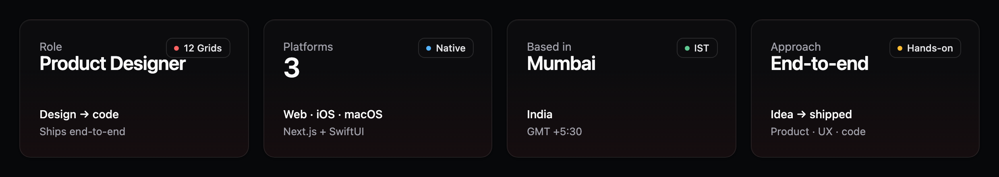
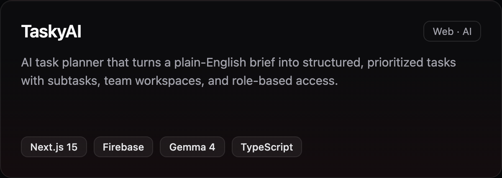
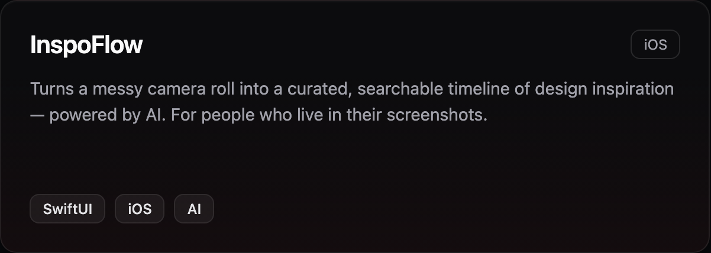
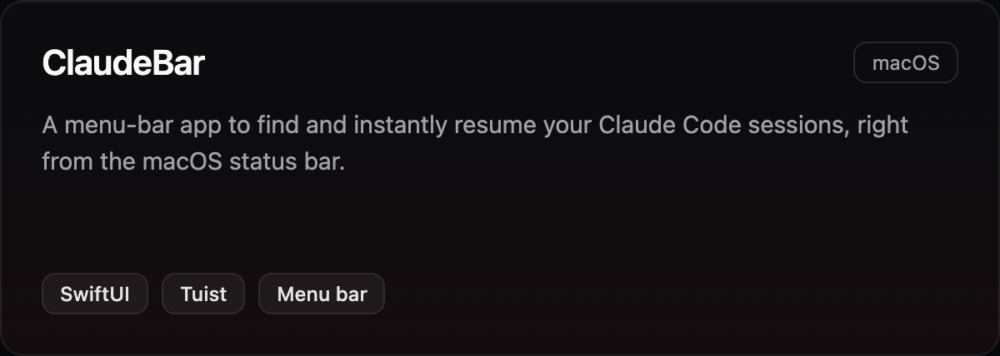
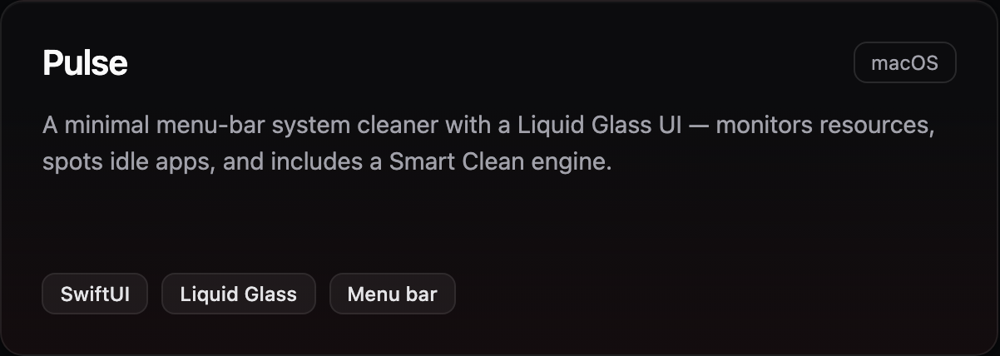
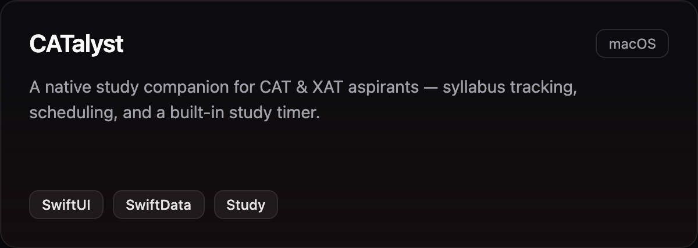

<h1 align="center">Hi, I'm Romeet 👋</h1>

  <b>Product Designer</b> — shipping real, vibe-coded products.

  📍 Mumbai &nbsp;·&nbsp; 🏢 12 Grids &nbsp;·&nbsp; Designing & building across web, iOS & macOS

  <a href="https://romeet.vercel.app"><b>🌐 Portfolio</b></a> &nbsp;·&nbsp; <a href="https://www.linkedin.com/in/romeet-chatterjee"><b>LinkedIn</b></a>

 

  

---

### 👋 About

I solve real user problems and bring ideas to life end-to-end — from product thinking and UX all the way to shipping the code. I work across **web, iOS, and macOS**, and I like taking a product from a rough idea to something real, polished, and usable.

---

### 🚀 Featured work

<table>
  <tr>
    <td width="50%"></td>
    <td width="50%"></td>
  </tr>
  <tr>
    <td width="50%"></td>
    <td width="50%"></td>
  </tr>
  <tr>
    <td width="50%"></td>
    <td width="50%"><a href="https://romeet.vercel.app"><b>&nbsp;&nbsp;→ See more on my portfolio</b></a></td>
  </tr>
</table>

> **TaskyAI** is live — [try the app](https://task-planner-seven-zeta.vercel.app) or the [guided demo](https://task-planner-seven-zeta.vercel.app/demo) (no signup).

---

### 🧰 Toolbox

**Design** &nbsp;·&nbsp; Framer &nbsp;·&nbsp; Figma &nbsp;·&nbsp; prototyping & product thinking
 
**Build** &nbsp;·&nbsp; Next.js &nbsp;·&nbsp; React &nbsp;·&nbsp; TypeScript &nbsp;·&nbsp; Tailwind &nbsp;·&nbsp; Firebase &nbsp;·&nbsp; SwiftUI &nbsp;·&nbsp; Swift

---

### 📫 Get in touch

<a href="https://romeet.vercel.app"><b>Portfolio</b></a> &nbsp;·&nbsp; <a href="https://www.linkedin.com/in/romeet-chatterjee"><b>LinkedIn</b></a>

Product designer who ships. Always building something.
